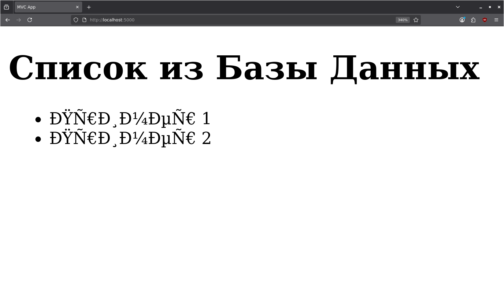

## Лабораторная работа по работе с docker
## Homework (by Daniel Zakirov IU8-23)

В репозитории приведен код web-приложения, которое сохраняет в БД введенную информацию о задаче - ее имя.

## Часть I. Docker

1. Добавьте в код Dockerfile, который позволит запустить web-приложение с исходным кодом в каталоге app/ через docker.

Мой [Dockerfile](Dockerfile)

2. Выполните запуск контейнера с этим приложением.

```console
$ sudo docker build -t dp-app .
```

<details><summary>Output</summary>

```
[+] Building 25.4s (10/10) FINISHED                                                                                                                docker:default
 => [internal] load build definition from Dockerfile                                                                                                         0.1s
 => => transferring dockerfile: 208B                                                                                                                         0.0s
 => [internal] load metadata for docker.io/library/python:3.14-slim                                                                                          7.2s
 => [internal] load .dockerignore                                                                                                                            0.1s
 => => transferring context: 2B                                                                                                                              0.0s
 => [1/5] FROM docker.io/library/python:3.14-slim@sha256:c845af9399020c7e562969a13689e929074a10fd057acd1b1fad06a2fb068e97                                    5.7s
 => => resolve docker.io/library/python:3.14-slim@sha256:c845af9399020c7e562969a13689e929074a10fd057acd1b1fad06a2fb068e97                                    0.1s
 => => sha256:99500e0cbdb98ad73639044dd5113029e40bdab38b4ea5fe594532bb79cbe57f 12.33MB / 12.33MB                                                             1.2s
 => => sha256:b83fa8e4dee39a3198704bc54184a177c88e40a821cb24d55437776d8cfdf85a 249B / 249B                                                                   0.4s
 => => sha256:dcf23796d1e8ae9b05eee16765fcf83722d2c0fdda9a27d09d25610a7ed9a0a0 1.05MB / 1.29MB                                                              17.5s
 => => sha256:5b4d6ff92fc4e14e911b7753c954fac965d48c40fe1075758d284148ccace970 29.78MB / 29.78MB                                                             2.3s
 => => extracting sha256:5b4d6ff92fc4e14e911b7753c954fac965d48c40fe1075758d284148ccace970                                                                    1.7s
 => => extracting sha256:dcf23796d1e8ae9b05eee16765fcf83722d2c0fdda9a27d09d25610a7ed9a0a0                                                                    0.2s
 => => extracting sha256:99500e0cbdb98ad73639044dd5113029e40bdab38b4ea5fe594532bb79cbe57f                                                                    0.9s
 => => extracting sha256:b83fa8e4dee39a3198704bc54184a177c88e40a821cb24d55437776d8cfdf85a                                                                    0.1s
 => [internal] load build context                                                                                                                            0.1s
 => => transferring context: 1.76kB                                                                                                                          0.0s
 => [2/5] WORKDIR /app                                                                                                                                       0.7s
 => [3/5] COPY app/requirements.txt .                                                                                                                        0.1s
 => [4/5] RUN pip install --no-cache-dir -r requirements.txt                                                                                                 5.7s
 => [5/5] COPY app/ .                                                                                                                                        0.2s 
 => exporting to image                                                                                                                                       5.2s 
 => => exporting layers                                                                                                                                      3.1s 
 => => exporting manifest sha256:a8408676a97f54e55d8f609e07628f0cbd64cec0eda5af06a1053f481bf75439                                                            0.0s 
 => => exporting config sha256:8694dc526288f4fe268ba81d8b2f898d950bb833ce30014be687b9612f9a7550                                                              0.1s 
 => => exporting attestation manifest sha256:bdf067e68d5f4508b9d836ef0cc09fff3a9a99db69e00f48fc8e233dbb1cedf2                                                0.1s 
 => => exporting manifest list sha256:702705b0db6b22b509914e2de06e3ad98b9f883397bda95fbfe8ea4e3fc4d485                                                       0.0s
 => => naming to docker.io/library/dp-app:latest                                                                                                             0.0s
 => => unpacking to docker.io/library/dp-app:latest    
```

</details>

```console
$ sudo docker run -p 5000:5000 --name dp-app-container dp-app
 * Serving Flask app 'app'
 * Debug mode: off
WARNING: This is a development server. Do not use it in a production deployment. Use a production WSGI server instead.
 * Running on all addresses (0.0.0.0)
 * Running on http://127.0.0.1:5000
 * Running on http://172.17.0.2:5000
Press CTRL+C to quit
172.17.0.1 - - [26/May/2026 19:20:23] "GET / HTTP/1.1" 200 -  # попытка посетить сайт - ОК
```

3. Скопируйте из консоли в каталог /home/ контейнера файл README.md.

```console
$ sudo docker cp README.md dp-app-container:/home/
Successfully copied 7.23kB (transferred 9.22kB) to dp-app-container:/home/
```

4. Подключитесь к терминалу контейнера с приложением в интерактивном режиме. Проверьте, что скопированный файл находится в нужном каталоге.

```console
$ sudo docker exec -it dp-app-container /bin/bash
root@9f21c9ce3f20:/app# ls -l /home/README.md 
-rw-rw-r-- 1 1000 1000 7229 May 26 19:22 /home/README.md
```

5. Выйдите из интерактивного режима.

```console
root@9f21c9ce3f20:/app# exit
```
Или <kbd>Ctrl</kbd>+<kbd>D</kbd>

6. Остановите контейнер с приложением.

```console
$ sudo docker stop dp-app-container
```

## Часть II. Docker compose
1. Создайте файл docker-compose.yml таким образом, чтобы совместно с описанным в части 1 контейнером работала бы база данных mysql. Файл инициализации БД в каталоге db/init.sql. Также пропишите порт подключения к приложению. Например 5000.

Мой [docker-compose](docker-compose.yml)

2. Запустите связку web-приложение - БД.

```console
$ sudo docker compose up --build
```

<details><summary>Output</summary>

```
[+] up 14/14
 ✔ Image mysql:8.0 Pulled                                                                                                                                    54.1s
[+] Building 2.3s (12/12) FINISHED                                                                                                                                
 => [internal] load local bake definitions                                                                                                                   0.0s
 => => reading from stdin 522B                                                                                                                               0.0s
 => [internal] load build definition from Dockerfile                                                                                                         0.0s
 => => transferring dockerfile: 208B                                                                                                                         0.0s
 => [internal] load metadata for docker.io/library/python:3.14-slim                                                                                          0.9s
 => [internal] load .dockerignore                                                                                                                            0.1s
 => => transferring context: 2B                                                                                                                              0.0s
 => [1/5] FROM docker.io/library/python:3.14-slim@sha256:c845af9399020c7e562969a13689e929074a10fd057acd1b1fad06a2fb068e97                                    0.1s
 => => resolve docker.io/library/python:3.14-slim@sha256:c845af9399020c7e562969a13689e929074a10fd057acd1b1fad06a2fb068e97                                    0.1s
 => [internal] load build context                                                                                                                            0.1s
 => => transferring context: 204B                                                                                                                            0.0s
 => CACHED [2/5] WORKDIR /app                                                                                                                                0.0s
 => CACHED [3/5] COPY app/requirements.txt .                                                                                                                 0.0s
 => CACHED [4/5] RUN pip install --no-cache-dir -r requirements.txt                                                                                          0.0s
 => CACHED [5/5] COPY app/ .                                                                                                                                 0.0s
 => exporting to image                                                                                                                                       0.4s
 => => exporting layers                                                                                                                                      0.0s
 => => exporting manifest sha256:4963fcf106e3a380fb939b0613d1552abb7cefea2dd22169387e54ee6a09db4d                                                            0.1s
 => => exporting config sha256:f0ab78db35997e49e9f9efc4a3970e5e6d07e9265aaffb517c1816e9a42bdb40                                                              0.0s
 => => exporting attestation manifest sha256:7309e87bc792f467e304a3ed1594f86db75c0901eae158788e550b544bc0ea1a                                                0.1s
 => => exporting manifest list sha256:049880f4bbd989b3067456dd1664eb778915ddd332abe60b4ca90a0a657d860b                                                       0.1s
 => => naming to docker.io/library/lab0docker-web:latest                                                                                                     0.0s
[+] up 18/18king to docker.io/library/lab0docker-web:latest                                                                                                  0.0s
 ✔ Image mysql:8.0            Pulled                                                                                                                         54.1s
 ✔ Image lab0docker-web       Built                                                                                                                           2.5s
 ✔ Network lab0docker_default Created                                                                                                                         0.2s
 ✔ Container dp-db-c          Created                                                                                                                         1.2s
 ✔ Container mvc-web          Created                                                                                                                         0.2s
Attaching to dp-db-c, mvc-web
Container dp-db-c Waiting 
dp-db-c  | 2026-05-26 19:42:22+00:00 [Note] [Entrypoint]: Entrypoint script for MySQL Server 8.0.46-1.el9 started.
dp-db-c  | 2026-05-26 19:42:23+00:00 [Note] [Entrypoint]: Switching to dedicated user 'mysql'
dp-db-c  | 2026-05-26 19:42:23+00:00 [Note] [Entrypoint]: Entrypoint script for MySQL Server 8.0.46-1.el9 started.
dp-db-c  | 2026-05-26 19:42:23+00:00 [Note] [Entrypoint]: Initializing database files
dp-db-c  | 2026-05-26T19:42:23.271637Z 0 [Warning] [MY-011068] [Server] The syntax '--skip-host-cache' is deprecated and will be removed in a future release. Please use SET GLOBAL host_cache_size=0 instead.
dp-db-c  | 2026-05-26T19:42:23.271712Z 0 [System] [MY-013169] [Server] /usr/sbin/mysqld (mysqld 8.0.46) initializing of server in progress as process 80
dp-db-c  | 2026-05-26T19:42:23.304192Z 1 [System] [MY-013576] [InnoDB] InnoDB initialization has started.
dp-db-c  | 2026-05-26T19:42:24.803595Z 1 [System] [MY-013577] [InnoDB] InnoDB initialization has ended.
dp-db-c  | 2026-05-26T19:42:27.417023Z 6 [Warning] [MY-010453] [Server] root@localhost is created with an empty password ! Please consider switching off the --initialize-insecure option.
dp-db-c  | 2026-05-26 19:42:33+00:00 [Note] [Entrypoint]: Database files initialized
dp-db-c  | 2026-05-26 19:42:33+00:00 [Note] [Entrypoint]: Starting temporary server
dp-db-c  | 2026-05-26T19:42:33.750865Z 0 [Warning] [MY-011068] [Server] The syntax '--skip-host-cache' is deprecated and will be removed in a future release. Please use SET GLOBAL host_cache_size=0 instead.
dp-db-c  | 2026-05-26T19:42:33.764901Z 0 [System] [MY-010116] [Server] /usr/sbin/mysqld (mysqld 8.0.46) starting as process 130
dp-db-c  | 2026-05-26T19:42:33.812415Z 1 [System] [MY-013576] [InnoDB] InnoDB initialization has started.
dp-db-c  | 2026-05-26T19:42:34.614410Z 1 [System] [MY-013577] [InnoDB] InnoDB initialization has ended.
dp-db-c  | 2026-05-26T19:42:35.167511Z 0 [Warning] [MY-010068] [Server] CA certificate ca.pem is self signed.
dp-db-c  | 2026-05-26T19:42:35.167618Z 0 [System] [MY-013602] [Server] Channel mysql_main configured to support TLS. Encrypted connections are now supported for this channel.
dp-db-c  | 2026-05-26T19:42:35.174465Z 0 [Warning] [MY-011810] [Server] Insecure configuration for --pid-file: Location '/var/run/mysqld' in the path is accessible to all OS users. Consider choosing a different directory.
dp-db-c  | 2026-05-26T19:42:35.201966Z 0 [System] [MY-011323] [Server] X Plugin ready for connections. Socket: /var/run/mysqld/mysqlx.sock
dp-db-c  | 2026-05-26T19:42:35.202101Z 0 [System] [MY-010931] [Server] /usr/sbin/mysqld: ready for connections. Version: '8.0.46'  socket: '/var/run/mysqld/mysqld.sock'  port: 0  MySQL Community Server - GPL.
dp-db-c  | 2026-05-26 19:42:35+00:00 [Note] [Entrypoint]: Temporary server started.
dp-db-c  | '/var/lib/mysql/mysql.sock' -> '/var/run/mysqld/mysqld.sock'
dp-db-c  | Warning: Unable to load '/usr/share/zoneinfo/iso3166.tab' as time zone. Skipping it.
dp-db-c  | Warning: Unable to load '/usr/share/zoneinfo/leap-seconds.list' as time zone. Skipping it.
dp-db-c  | Warning: Unable to load '/usr/share/zoneinfo/leapseconds' as time zone. Skipping it.
dp-db-c  | Warning: Unable to load '/usr/share/zoneinfo/tzdata.zi' as time zone. Skipping it.
dp-db-c  | Warning: Unable to load '/usr/share/zoneinfo/zone.tab' as time zone. Skipping it.
dp-db-c  | Warning: Unable to load '/usr/share/zoneinfo/zone1970.tab' as time zone. Skipping it.
dp-db-c  | 2026-05-26 19:42:41+00:00 [Note] [Entrypoint]: Creating database dp-db
dp-db-c  | 2026-05-26 19:42:41+00:00 [Note] [Entrypoint]: Creating user dp
dp-db-c  | 2026-05-26 19:42:41+00:00 [Note] [Entrypoint]: Giving user dp access to schema dp-db
dp-db-c  | 
dp-db-c  | 2026-05-26 19:42:41+00:00 [Note] [Entrypoint]: /usr/local/bin/docker-entrypoint.sh: running /docker-entrypoint-initdb.d/init.sql
dp-db-c  | 
dp-db-c  | 
dp-db-c  | 2026-05-26 19:42:41+00:00 [Note] [Entrypoint]: Stopping temporary server
dp-db-c  | 2026-05-26T19:42:41.500455Z 14 [System] [MY-013172] [Server] Received SHUTDOWN from user root. Shutting down mysqld (Version: 8.0.46).
dp-db-c  | 2026-05-26T19:42:43.702109Z 0 [System] [MY-010910] [Server] /usr/sbin/mysqld: Shutdown complete (mysqld 8.0.46)  MySQL Community Server - GPL.
dp-db-c  | 2026-05-26 19:42:44+00:00 [Note] [Entrypoint]: Temporary server stopped
dp-db-c  | 
dp-db-c  | 2026-05-26 19:42:44+00:00 [Note] [Entrypoint]: MySQL init process done. Ready for start up.
dp-db-c  | 
dp-db-c  | 2026-05-26T19:42:44.844482Z 0 [Warning] [MY-011068] [Server] The syntax '--skip-host-cache' is deprecated and will be removed in a future release. Please use SET GLOBAL host_cache_size=0 instead.
dp-db-c  | 2026-05-26T19:42:44.846092Z 0 [System] [MY-010116] [Server] /usr/sbin/mysqld (mysqld 8.0.46) starting as process 1
dp-db-c  | 2026-05-26T19:42:44.869136Z 1 [System] [MY-013576] [InnoDB] InnoDB initialization has started.
dp-db-c  | 2026-05-26T19:42:45.213173Z 1 [System] [MY-013577] [InnoDB] InnoDB initialization has ended.
dp-db-c  | 2026-05-26T19:42:45.483286Z 0 [Warning] [MY-010068] [Server] CA certificate ca.pem is self signed.
dp-db-c  | 2026-05-26T19:42:45.483372Z 0 [System] [MY-013602] [Server] Channel mysql_main configured to support TLS. Encrypted connections are now supported for this channel.
dp-db-c  | 2026-05-26T19:42:45.491469Z 0 [Warning] [MY-011810] [Server] Insecure configuration for --pid-file: Location '/var/run/mysqld' in the path is accessible to all OS users. Consider choosing a different directory.
dp-db-c  | 2026-05-26T19:42:45.515273Z 0 [System] [MY-011323] [Server] X Plugin ready for connections. Bind-address: '::' port: 33060, socket: /var/run/mysqld/mysqlx.sock
dp-db-c  | 2026-05-26T19:42:45.515341Z 0 [System] [MY-010931] [Server] /usr/sbin/mysqld: ready for connections. Version: '8.0.46'  socket: '/var/run/mysqld/mysqld.sock'  port: 3306  MySQL Community Server - GPL.
Container dp-db-c Healthy 
mvc-web  |  * Serving Flask app 'app'
mvc-web  |  * Debug mode: off
mvc-web  | WARNING: This is a development server. Do not use it in a production deployment. Use a production WSGI server instead.
mvc-web  |  * Running on all addresses (0.0.0.0)
mvc-web  |  * Running on http://127.0.0.1:5000
mvc-web  |  * Running on http://172.18.0.3:5000
mvc-web  | Press CTRL+C to quit
mvc-web  | 172.18.0.1 - - [26/May/2026 19:43:21] "GET / HTTP/1.1" 200 -
mvc-web  | 172.18.0.1 - - [26/May/2026 19:43:21] "GET /favicon.ico HTTP/1.1" 404 -  # хехе, ожидаемо
```

</details>

3. Проверьте подключение к приложению через браузер. Сделайте снимок экрана.



4. Проверьте работу приложения через браузер.

```console
$ curl http://localhost:5000
<!DOCTYPE html>
<html>
<head>
    <meta charset="utf-8">
    <title>MVC App</title>
</head>
<body>
    <h1>Список из Базы Данных</h1>
    <ul>
        
            <li>Пример 1</li>
        
            <li>Пример 2</li>
        
    </ul>
</body>
</html>
```
